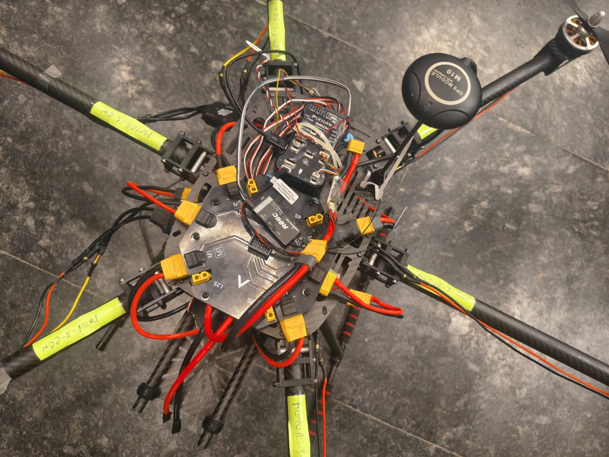
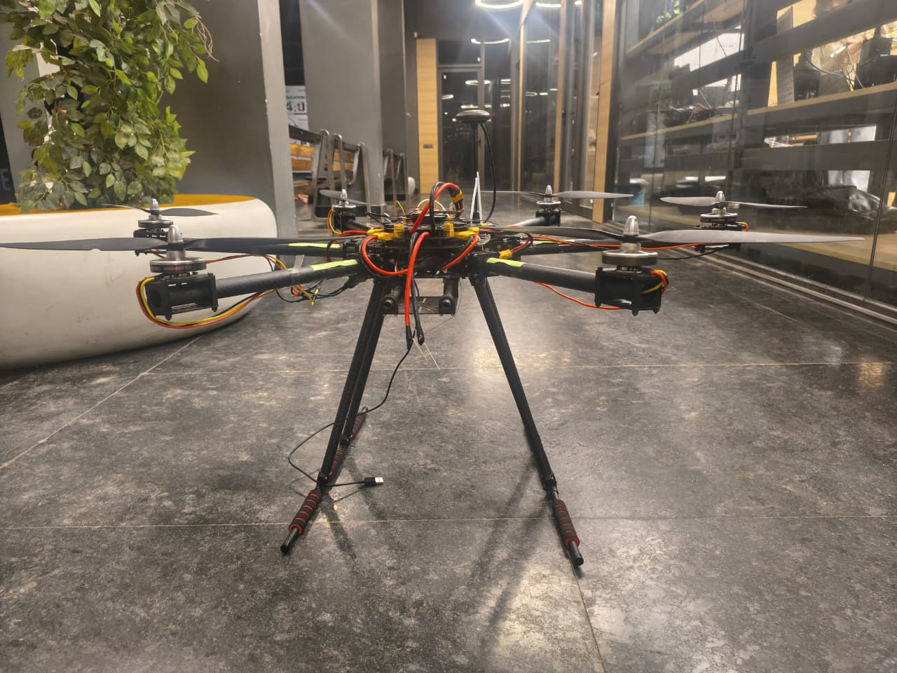
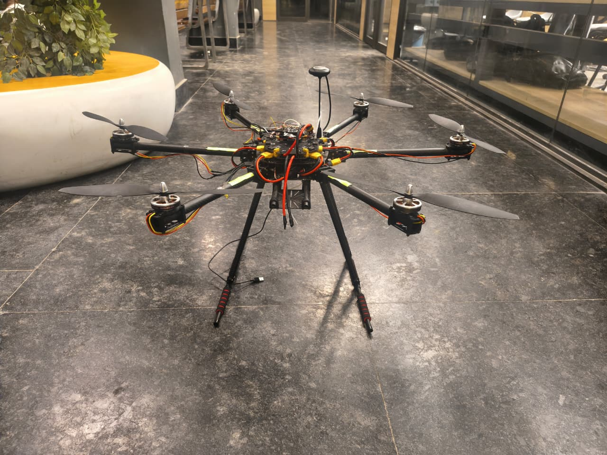
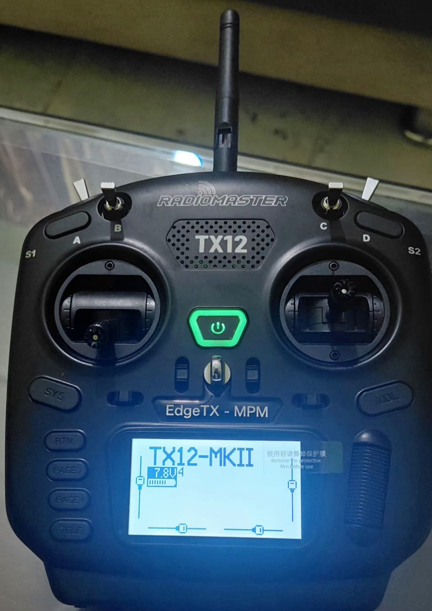

# 🛰️ SKY P@TROL

## AI-Powered Autonomous Search & Rescue System

<p align="center">

**Smart India Hackathon 2026 • Problem Statement 26177**

</p>

<p align="center">

<i>
An intelligent, deployable drone-based search-and-rescue ecosystem
designed to assist emergency teams in detecting potential survivors,
identifying fire/smoke hazards, locating critical events, and
visualizing mission intelligence in real time.
</i>

</p>

<p align="center">

`Artificial Intelligence` • `Computer Vision` • `Autonomous Drones` • `GPS` • `Telemetry` • `Robotics`

</p>

---

# 🚨 Problem Statement

During disasters such as **floods, landslides, forest fires and other emergency situations**, rescue teams often operate in environments where conventional ground-based search becomes difficult, slow and potentially hazardous.

### Major Challenges

- 🌊 Large and difficult-to-access disaster areas
- 🌫️ Poor visibility and unpredictable environmental conditions
- 👤 Difficulty in locating people in affected regions
- ⏱️ Delayed identification of critical situations
- ⚠️ Risk to rescue personnel entering hazardous zones
- 📡 Scattered field information
- 🗺️ Lack of centralized situational awareness
- 🚁 Limited aerial intelligence during emergency response

Traditional ground-based operations may require significant time and manpower to search large or inaccessible regions.

---

# 💡 Our Solution

**SKY P@TROL** is an AI-assisted drone-based search-and-rescue ecosystem that combines:

- 🛩️ A physical multi-rotor drone platform
- 📷 Aerial image acquisition
- 🧠 AI-assisted computer vision
- 📍 GPS-based location intelligence
- 📡 Telemetry and communication
- 🖥️ Ground Command Center
- 🚨 Detection and alert management

The system transforms aerial observations into structured information that can support emergency response teams.

### Core Workflow

```text
SEARCH
   ↓
DETECT
   ↓
LOCATE
   ↓
ANALYZE
   ↓
VISUALIZE
   ↓
RESPOND

🛰️ System Architecture

SKY P@TROL is organized into three major stages.
```text
┌─────────────────────────────────────────────────────────────┐
│                    SKY P@TROL ECOSYSTEM                     │
├─────────────────────────────────────────────────────────────┤
│                                                             │
│  STAGE 1              STAGE 2              STAGE 3          │
│  AIRBORNE             ON-BOARD             GROUND           │
│  PLATFORM             INTELLIGENCE         COMMAND CENTER   │
│                                                             │
│  Drone Platform   →   AI Detection     →   Rescue Dashboard│
│  GPS / Telemetry      Person Detection     Live Location   │
│  Camera               Hazard Detection         Alerts & Logs│
│  Flight System        Data Processing      Mission View   │
│                                                             │
└─────────────────────────────────────────────────────────────┘

🛩️ STAGE 1 — DRONE PLATFORM

The airborne layer provides the physical aerial platform required for disaster-area reconnaissance and observation.

Hardware Components
Multi-rotor drone frame
Brushless motors
Propulsion system
Flight controller
Power distribution system
GPS subsystem
Camera interface
Telemetry system
Radio-control system
Rechargeable battery system
Expandable payload architecture

The modular design allows additional sensors and payloads to be integrated as the project evolves.

<p align="center">  </p> <p align="center">

<b>Multi-Rotor Drone Prototype — Top View</b>

</p>
<p align="center">  </p> <p align="center">

<b>Multi-Rotor Drone Prototype — Side View</b>

</p>
<p align="center">  </p> <p align="center">

<b>Multi-Rotor Drone Prototype</b>

</p>
<p align="center">  </p> <p align="center">

<b>Ground Control</b>

</p>

🧠 STAGE 2 — ON-BOARD INTELLIGENCE

The intelligence layer processes aerial observations and identifies events relevant to search-and-rescue operations.

AI-Assisted Detection

The system is designed to identify and log:

👤 Person / potential-person detections
🔥 Hazard observations
📍 Geo-tagged detection locations
⏱️ Detection timestamps
🚁 Source drone identification
🚨 Mission-relevant detection events

🔍 AI Detection Pipeline
                    ┌─────────────────┐
                    │   DRONE CAMERA  │
                    └────────┬────────┘
                             │
                             ▼
                    ┌─────────────────┐
                    │ IMAGE ACQUISITION│
                    └────────┬────────┘
                             │
                             ▼
                    ┌─────────────────┐
                    │   AI DETECTION  │
                    │      MODEL      │
                    └────────┬────────┘
                             │
                     ┌───────┴───────┐
                     ▼               ▼
              ┌────────────┐   ┌────────────┐
              │   PERSON   │   │ FIRE/SMOKE │
              │  DETECTION │   │  DETECTION │
              └─────┬──────┘   └──────┬─────┘
                    │                 │
                    └────────┬────────┘
                             ▼
                    ┌─────────────────┐
                    │ GEO-TAGGED      │
                    │ OBSERVATION     │
                    └────────┬────────┘
                             │
                             ▼
                    ┌─────────────────┐
                    │ GROUND COMMAND  │
                    │     CENTER      │
                    └─────────────────┘

🖥️ STAGE 3 — GROUND COMMAND CENTER

The Ground Command Center acts as the central software interface for monitoring incoming observations and mission information.

It converts raw telemetry and detection events into a structured operational view.

🎯 Core Capabilities
Feature	Function
📍 Location Intelligence	Displays geo-tagged observations
👤 Person Detection	Records person/potential-person detection events
🔥 Fire/Smoke Detection	Logs fire and smoke observations
🚁 Drone Monitoring	Identifies active drone sources
🚨 Alert Management	Organizes important detection events
🗺️ Map Visualization	Displays observations geographically
📊 Mission Statistics	Provides operational metrics
📝 Event History	Maintains detection records
🔄 Live Data Handling	Supports incoming telemetry updates
📡 SYSTEM DATA FLOW
                  ┌──────────────────────┐
                  │    DRONE PLATFORM    │
                  │                      │
                  │ Camera + GPS +       │
                  │ Flight Telemetry     │
                  └──────────┬───────────┘
                             │
                             ▼
                  ┌──────────────────────┐
                  │ ON-BOARD / EDGE AI   │
                  │                      │
                  │ Person Detection     │
                  │ Fire / Smoke         │
                  └──────────┬───────────┘
                             │
                             ▼
                  ┌──────────────────────┐
                  │    COMMUNICATION     │
                  │                      │
                  │ Telemetry / Socket   │
                  │ Based Data Transfer  │
                  └──────────┬───────────┘
                             │
                             ▼
              ┌──────────────────────────────┐
              │     GROUND COMMAND CENTER   │
              │                              │
              │ Map • Alerts • Logs • Data   │
              │ Mission Intelligence         │
              └──────────────┬───────────────┘
                             │
                             ▼
                  ┌──────────────────────┐
                  │   RESCUE RESPONSE    │
                  │   & HUMAN DECISION   │
                  └──────────────────────┘
📊 MISSION DATA MODEL

The Ground Command Center processes structured telemetry and detection information.

Core Data Fields
latitude
longitude
personDetected
fireDetected
timestamp
droneId
source
status
Data Source
LIVE
SIMULATION
Event Status
ACTIVE
ACKNOWLEDGED
RESOLVED

This structure allows the system to distinguish live operational data from testing and simulation data.

🛠️ TECHNOLOGY STACK
💻 Frontend
React 18
Vite
TypeScript
Tailwind CSS
Leaflet
React-Leaflet
Lucide Icons
Socket.IO Client
⚙️ Backend
Node.js
Express.js
TypeScript
Mongoose
Socket.IO Server
🗄️ Database
MongoDB
In-memory fallback for development/testing
🧠 Artificial Intelligence
YOLO-based computer vision pipeline
Aerial image analysis
Person detection
Fire/smoke detection
🚁 Drone & Embedded Systems
Multi-rotor UAV platform
Flight controller
GPS
Telemetry
Camera subsystem
Radio-control system
Power distribution system
🔄 REAL-TIME COMMUNICATION

The architecture supports structured communication between the aerial platform, backend and Ground Command Center.

                 ┌───────────────┐
                 │     DRONE     │
                 └───────┬───────┘
                         │
                         │ Telemetry
                         │ Detection Data
                         ▼
                 ┌───────────────┐
                 │    BACKEND    │
                 │    SERVER     │
                 └───────┬───────┘
                         │
                         │ Socket Communication
                         ▼
             ┌────────────────────────┐
             │   COMMAND CENTER       │
             │                        │
             │  Live Map              │
             │  Alerts                │
             │  Mission Statistics    │
             │  Event History         │
             └────────────────────────┘

The communication architecture is designed to support future multi-drone expansion.

🎯 KEY FEATURES
🛩️ 1. Aerial Search

The drone provides an aerial observation layer for areas that may be difficult or unsafe for ground teams to inspect directly.

🧠 2. AI-Assisted Detection

Computer vision assists in identifying people and fire/smoke-related observations from aerial imagery.

📍 3. GPS-Based Localization

Detection events can be associated with geographical coordinates to support location-aware response.

🗺️ 4. Situational Awareness

Mission information is visualized through a centralized map and event-management interface.

🚨 5. Detection Alerts

Important observations can be surfaced as actionable events for operator review.

📡 6. Telemetry Integration

The system architecture supports structured telemetry exchange between the aerial platform and command center.

🧩 7. Modular Architecture

Additional sensors, AI models, communication systems and drones can be integrated as the platform evolves.

🧪 TESTING & SIMULATION

A simulation mode allows the Ground Command Center to be tested independently from the physical drone.

Example Simulation Event
SOURCE      : SIMULATION
DRONE ID    : SKY-01
EVENT       : Person Detected
LATITUDE    : 30.xxxxx
LONGITUDE   : 77.xxxxx
STATUS      : ACTIVE
TIMESTAMP   : YYYY-MM-DD HH:MM:SS
Simulation Enables Testing Of
Map visualization
Detection events
Alert handling
Event status changes
Mission statistics
Backend communication
Dashboard workflows
🔐 SAFETY & RELIABILITY PRINCIPLES
Human-in-the-Loop

AI-generated observations assist operators rather than independently making final rescue decisions.

Detection ≠ Confirmation

A detected person is treated as a potential observation until appropriately verified by rescue personnel.

Modular Expansion

Sensors and intelligence modules can be added without redesigning the complete platform.

Simulation Support

Mission workflows can be tested without requiring a live drone flight.

Operational Awareness

The system focuses on converting field observations into information that can support human decision-making.

🌍 POTENTIAL APPLICATIONS

The SKY P@TROL architecture can be adapted for multiple emergency-response scenarios.

🌊 Flood Search & Rescue

Aerial reconnaissance of affected and inaccessible areas.

⛰️ Landslide Response

Rapid observation of difficult terrain following landslides.

🔥 Forest-Fire Monitoring

Detection and monitoring of fire/smoke observations.

🧍 Missing-Person Search

Aerial assistance for large-area search operations.

🏚️ Post-Disaster Assessment

Rapid aerial assessment of affected infrastructure and regions.

⚠️ Hazardous-Area Inspection

Remote observation of environments that may pose risks to personnel.

📈 OPERATIONAL WORKFLOW
┌───────────────────────────────────────────┐
│              MISSION START                │
└─────────────────────┬─────────────────────┘
                      ▼
              🛩️ DRONE DEPLOYMENT
                      │
                      ▼
              📷 AREA OBSERVATION
                      │
                      ▼
              🧠 AI PROCESSING
                      │
            ┌─────────┴─────────┐
            ▼                   ▼
       👤 PERSON            🔥 FIRE/SMOKE
       DETECTION             DETECTION
            │                   │
            └─────────┬─────────┘
                      ▼
                 📍 LOCATION
                      │
                      ▼
               📡 DATA TRANSFER
                      │
                      ▼
             🖥️ COMMAND CENTER
                      │
                      ▼
                🚨 ALERT REVIEW
                      │
                      ▼
              👨‍🚒 HUMAN RESPONSE
🔮 FUTURE SCOPE

The current architecture provides a foundation for developing a more advanced autonomous disaster-response platform.

Future extensions may include:

🤖 Advanced autonomous navigation
🚁 Multi-drone coordination
🌡️ Thermal imaging
🌙 Enhanced night-time detection
🧠 Improved edge-AI inference
🔥 Advanced fire and smoke analysis
📍 Improved survivor localization
📡 Extended communication systems
🗺️ Mission route optimization
📊 Advanced mission analytics
🛰️ Multi-source disaster intelligence
🎯 Automated search-area prioritization


###Team Members:

-**Sumaira**
-**Shiny Dhingra**
-**Nevid Alam**
-**Mukul**
-**Deepanshu**
-**Sawan**

###From Panipat Institute of Engineering and Technology
